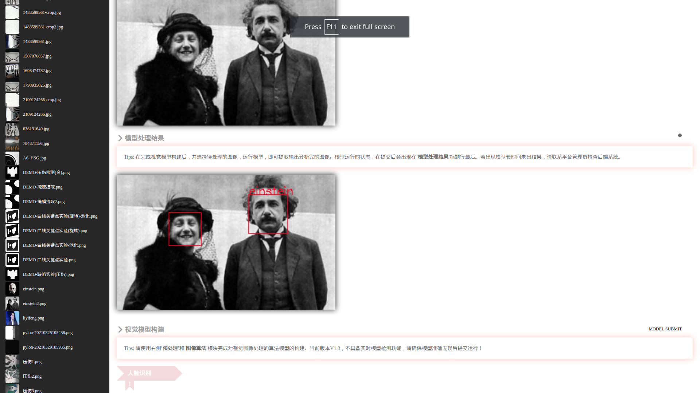

# cv-algo-analysis

As it's project name, i wrote a visual page based on web to display the vision algorithm analysis!

将常用的视觉算法进行流程化，模块化，便于快速构建视觉算法的分析模型．另外，还有pylon工业相机图像采集的功能．

## Installation

Run command `chmod +x build.sh && ./build.sh`

运行上述命令快速构建程序运行环境．

## Run

Run command `python server/server.py`

Then, you can access your local web page by browser!(http://127.0.0.1:8081). Don't forget add some pictures which you want to analysis in 'images' directory.

运行上述命令启动程序，用浏览器访问(http://127.0.0.1:8081).
别忘记在images目录下面添加一些你想要分析的图片．

## Description

The project provided the basic functions, like HOUGH CIRCLE/LINE, MSER. If you want some new functions, you can modify project files by yourself!

该项目仅提供基础功能，如霍夫圆/直线，分水岭等．如果你想要一些新功能，可以自行修改项目中文件．

GUI like this:

Simple application:

